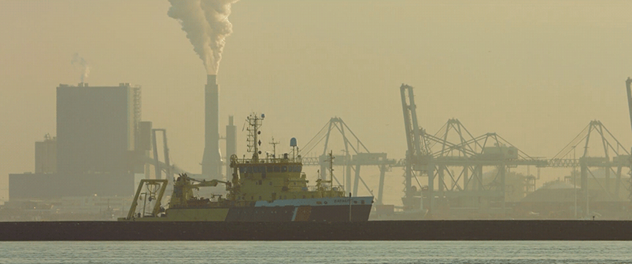

# 360° Video and Audio Capture for VR Applications

## Introduction: The Great Skrillex Train Dome

The purpose of this document is to bring together seemingly disparate media in order to provide a clearer picture of how immersive VR experiences can be developed into 'cinematic' storytelling devices with elements that are unique to the medium.

It all started when Skrillex and crew needed something to keep them entertained while on tour during the [Full Flex Express Train Tour](http://www.redbull.com/us/en/music/stories/1331734097886/skrillex-and-his-full-flex-express-hits-canada) through Canada back in 2012. It seems a large television or projector wasn't enough for this crew, so it was decreed that the hang out car would be outfitted with a 7 foot upright dome within which would be a custom playable musical visualizer (which I developed in Unity3D), a 'domed' version of the XBox, and a bunch of original video content shot with spherical lenses specifically for presentation within a dome installation. I was hired to develop the Unity experience, build a custom PC for the installation, figure out how to project XBox games onto a dome, create a player for the spherical video, projection map the project, and develop an application that would allow users to switch modes between all the content types on the dome. Above you will see a picture of the final installation (which they conveniently didn't invite me to, which I am kind of glad about because if you notice the dome was a little too big and they had to straight up cut holes in the side of the car to allow for the installation). Overall, as far as I was made aware, the project was a success.

In the process of developing this project and researching elements for it, I began to discover a plethora of resources around such things as panoramas, dome projection mapping and warping, spherical photography, and so much more, all related to the creation and presentation of full scale 3D, 180° to 360° experiences using multiple formats and media (e.g. video, game engine, original 3D content, custom applications in openframeworks, etc). What I have recently realized is that many of these topics and resources are applicable to the creation of 3D environments for immersive VR experiences. The topics, techniques, and ideas I find most relevant to VR are what I would like to explore and document here in order to have in a single location many of the elements that could be used to create and develop unique and original experience using the latest developments and trends in viewing devices.

working notes:
*in the past I have done a plethora of research into immersive environment capture, augmentation, and presentation
projection onto dome shaped surfaces, 360° video applications, scene creation in Unity3D
new and inventive ways to capture an aesthetic that has yet to be seen or used in immersive applications.
imo technical limitations create new opportunities for inventiveness and provide an atmosphere where a new aesthetic can be created; 
some of this is inspiration, thought starters, technical resources, 
but mainly this is a living document that can be referred to in order to immerse oneself immersive experience creation. Its a document to explore what is emerging, and what is about to be possible. *

#### What Does Any of This Have to do with Virtual Reality?!
It is my observation that this first wave of VR using mobile devices, and this new surge of interest and investment in VR products has its on primarily two things: gaming and immersive documentaries.
yet original and unique art, aesthetics and storytelling are waiting in the wings, ready to be compellingly used within VR. 'Cinematics' in the medium will come about with a new breed of creators who will start defining the cinematic language, concepts, and approaches that will take this emerging format to the next level, eventually allowing it to stand on its own as an entirely new and 'proper' art form.

It is my firm belief that the most compelling approaches to immersive storytelling within the VR medium will be include such concepts as non-linearty, contrasted and varied temporality, visual juxtaposition, mixed media (3D Video with CGI), 3D soundscapes, and new digital aesthtics. Through the inclusion of opposites, the pairing and mixing of mediums, and a fervent experimental spirit, VR will become 'its own thing' and those at the forefront of the medium will have an opportunity to create an entirely new art form.

The ideas, approaches, concepts, and inspirations found in this document are meant to provide an entry point and a topical resource that will help define how VR becomes as original a storytelling medium as cinema and 'cinematic' television.

Overall, this document is dedicated to capturing panoramas, spherical video, and how to do all this on a budget, or with a creative approach that produces a creative aesthetic. All of this has a clear path to being integrated into experience for YouTube 360 Video, Google Cardboard, Occulus Rift, etc. Through this document you can find everything you need to create worlds that can be inhabited and interacted with via the various VR mediums available today.

Concepts: juxtaposition, non-linearity, duality, paradox, immersion, hyperreality, professional-grade DIY

[Paul Bourke](#paul-bourke)

[Cinemagraphs and GIF Art](#cinemagraphs-and-gif-art)

[Chronopanorama](#chronopanorama)

[Spherical Image Capture](#spherical-image-capture)

[Fisheye Lenses](#fisheye-lenses)

[DIY 360 Rigs](#diy-360-rigs)

[3D and Binaural Sound Capture](#3d-and-binaural-sound-capture)

[Output Formats for Use in VR](#output-formats-for-vr)

[Additional Resources and Links](#additional-resources-and-links)

## Paul Bourke
Paul Bourke is the man. He is an Australian professor who has been working for the last few decades on everything related to immersive media via his original work and research into such things as dome projection, 3D geometry and materials, the math related to projection mapping, how to capture panoramas, how to project panorama into physical environments, and so so so so much more. He is actively working, speaking at conferences, and as far as I know, is still the number 1 goto resource for projection mapping and immersive environment creation; the math, the code, the concepts, the tools, he has done all of it!

His main focus for a time was related to [large and full scale dome projection installations](http://paulbourke.net/dome/faq.html), but in the process his work has also become highly applicable to the creation of 3D and 360° environments in VR. 

Jump into the rabbit hole here: http://paulbourke.net/

Paul Bourke's work and concepts will be referenced and linked to throughout this document, and while many of his works are older, the concepts and approaches and math, are still sound and very much applicable to capturing, creating, and producing immersive experiences.

## Chronopanorama

http://paulbourke.net/miscellaneous/timelapsepano/

A combination of time-lapse and panorama, Chronopanorama is a photographic technique and aesthetic that emphasizes and time juxtaposition and provides a DIY approach for creating 360 imagery for use in VR.

## Cinemagraphs and GIF Art

### Cinemagraphs

> A cinemagraph is a living moment in an otherwise still photograph. It exists in the world in between a photograph and video to bring to life the image and make it last forever. - Cinemagraphs.com

#### Cinemagraphs.com

Kevin Burg and Jamie Beck are a photographers that have been traveling the world for very large clients, taking some amazing photographs, and bringing them to life utilizing subtle movements with the stillness of the photograph. Almost unnoticeable at times, the movement provides an interesting juxtaposition against the static image the movements exists within. Check out their work here: [cinemagraphs.com](http://cinemagraphs.com/)

### GIF Art

#### REED+RADER

Pamela Reed and Matthew Rader, known as [REED+RADER](http://reedandrader.com/) are a couple of friends of mine that are, in my my opinion, pushing the boundaries of the moving image in a bright and unique way, unlike anything I have ever seen. Through integration of unique hair and makeup, set designs, multi-angle still photography, video, 3D game engines, and more, these two very interesting people have swiftly become a highly sought after production team for large fashion and entertainment clients. For example, you may have seen their [recent promos for the MTV Music Awards featuring Miley Cyrus](http://reedandrader.com/mtvvmas.html#content) ( and her cat ):

### So What Do GIFs, Chronopanoramas, and Cinemagraphs Have to Do With VR?!
Playing with time and movement, playing with perspective and mixed imagery, creative uses of cameras to create panoramas whilst also creating an interesting aesthetic: these are all reason I think these are important to the creation of VR experiences. 

Any panorama can be turned into an environment, cubemap, and/or skybox within 3D game engines, WebGL, openGL, etc. Creating panorama with chronopanaorma would provide an interesting 'place' to visit within VR which play with time and expectation. With the addition of mixed media and cinemagraphic techniques, these concepts seem to provide an interesting foundation for storytelling in a way no one has experienced before in immersive applications.

In addition, Chronopanorama and Cinemagraphs could be captured with pairs of cameras creating an additional immersive element with stereoscopy, that is, instead of having simply being surrounded by a flat panorama in a VR experience, if the panorama itself was stereoscopic it would provide an additional layer of depth for the scene. See the 5 sided DIY GoPro VR Rig on this page as it illustrates the setup for a pairs of cameras on each side, which provides a panorama as well as a stero images for each piece of the panorama.

## DIY 360 Rigs

### Spherical Image Capture

### Fisheye Lenses

When creating content for a full-size dome projection, a 180° fisheye lens was used to capture high resolution video to be projected into the dome, providing users a view that engaged their peripheral vision, virtually stepping into the image. The 180° content was also used in a custom iOS app that allowed the user to pan around the 180° view. 

This was nearly 5 years ago, and VR was still only a dream, but a dream on the horizon. Using 2-3 180° degree camera rigs or, creative stitching of video and imagery captured from a single DSLR with a fisheye lens, this method could be used to capture and/or create compelling high resolution 360° visualscapes for VR and 360 video applications. 

Links: 
[180° 8-15mm Canon Fisheye Lens](http://explore-lenses.usa.canon.com/ef_8-15mm_f4l_fisheye_usm.html)
[Paul Bourke's Fisheye Lens Comparison Table](http://paulbourke.net/dome/scarlet/)
[Paul Bourke's Fisheye Projection Warping](http://paulbourke.net/dome/fisheye/)

### With GoPros

http://thecreatorsproject.vice.com/blog/break-from-real-life-with-vr-cinemagraphs

http://punkoryan.com/2011/02/08/shooting-360-degree-video-with-four-gopro-hd-hero-cameras

### Learn360Photography.com: A Comprehensive Tutorial Using Various Devices and Approaches
http://www.learn360photography.com/

## Professional 360 Cameras
#### Ladybug5 

https://www.ptgrey.com/ladybug5-360-degree-usb3-spherical-camera-systems

...need more...

## 3D and Binaural Sound Capture
in progress

## Output Formats for VR
in progress

## Additional Resources and Links
in progress: outline:
- panorama software
- cameras
- rigs
- code

