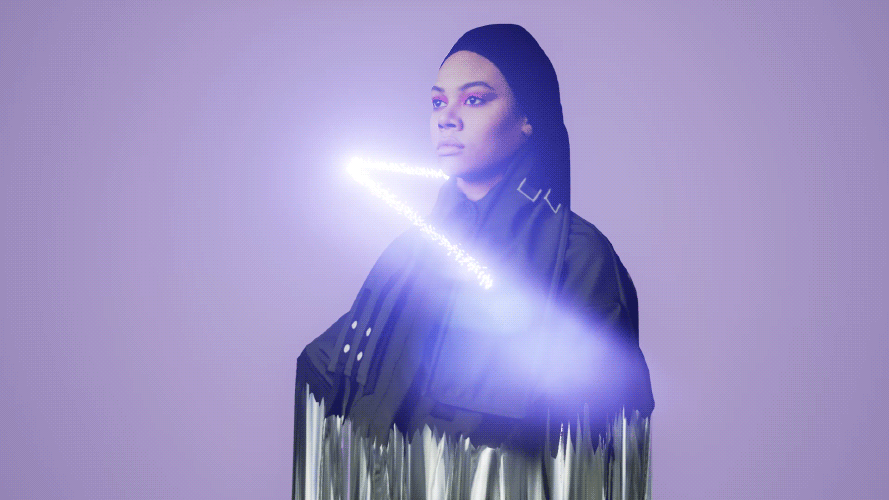
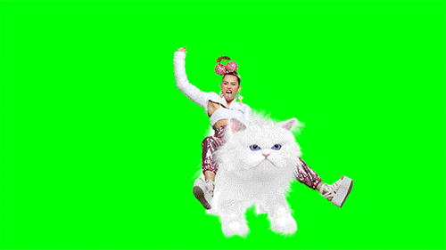

# 360° Video and Audio Capture for VR Applications
[Project: Skrillex Train Dome](#skrillex-train-dome)

[Paul Bourke](#paul-bourke)

[Spherical Image Capture](#spherical-image-capture)

[Fisheye Lenses](#fisheye-lenses)

[Cinemagraphs and GIF Art](#cinemagraphs-and-gif-art)

[DIY 360 Rigs](#diy-360-rigs)

[Output Formats](#output-formats)

[Additional Resources and Links](#additional-resources-and-links)

## Introduction and Philosophy

in the past I have done a plethora of research into immersive environment capture, augmentation, and presentation
projection onto dome shaped surfaces, 360° video applications, scene creation in Unity3D
new and inventive ways to capture an aesthetic that has yet to be seen or used in immersive applications.
imo technical limitations create new opportunities for inventiveness and provide an atmosphere where a new aesthetic can be created; 
some of this is inspiration, thought starters, technical resources, 
but mainly this is a living document that can be referred to in order to immerse oneself immersive experience creation. Its a document to explore what is emerging, and what is about to be possible. 

## Skrillex Train Dome

## Paul Bourke

## Spherical Image Capture

## Fisheye Lenses

## Cinemagraphs and GIF Art

### Cinemagraphs
Somewhere between the still image and movie exists the *cinemagraph*.

> A cinemagraph is a living moment in an otherwise still photograph.

http://thecreatorsproject.vice.com/blog/break-from-real-life-with-vr-cinemagraphs

#### Cinemagraphs.com
[cinemagraphs.com](http://cinemagraphs.com/)

### GIF Art

#### REED+RADER

http://reedandrader.com/

Pamela Reed and Matthew Rader, known as REED+RADER are a couple of friends of mine that are, in my my opinion, pushing the boundaries of the moving image in a bright and unique way, unlike anything I have ever seen. Through integration of unique hair and makeup, set designs, multi-angle still phototography, video, 3D game engines, and more, these two very interesting people have swiftly become a highly sought after production team for large fashion and entertainment clients. For example, you may have seen their [recent promos for the MTV Music Awards featuring Miley Cyrus](http://reedandrader.com/mtvvmas.html#content) ( and her cat ):

## DIY 360 Rigs

http://thecreatorsproject.vice.com/blog/break-from-real-life-with-vr-cinemagraphs

http://punkoryan.com/2011/02/08/shooting-360-degree-video-with-four-gopro-hd-hero-cameras

## Professional 360 Cameras
#### Ladybug5 

https://www.ptgrey.com/ladybug5-360-degree-usb3-spherical-camera-systems

## Output Formats

## Additional Resources and Links
- panorama software
- camera
- rigs
- code

