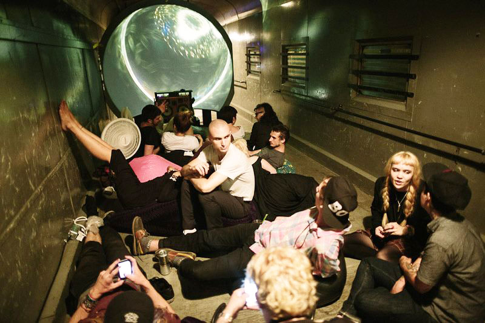
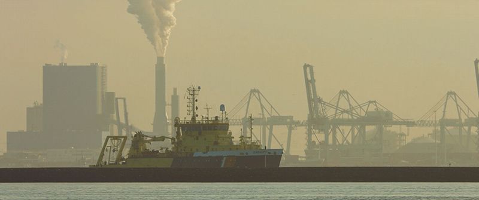
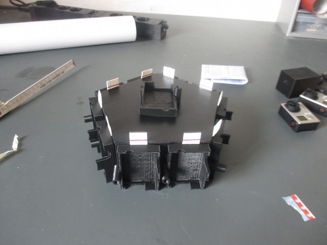
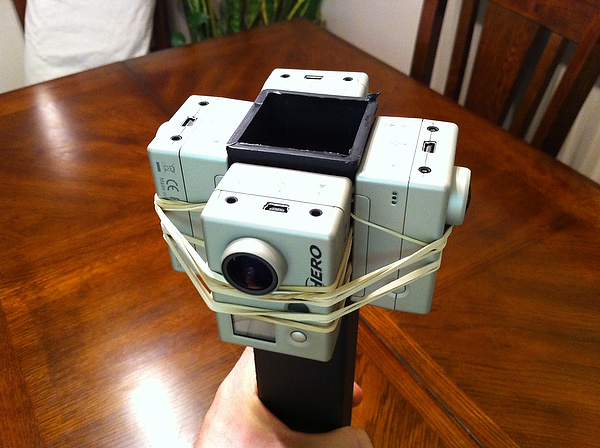
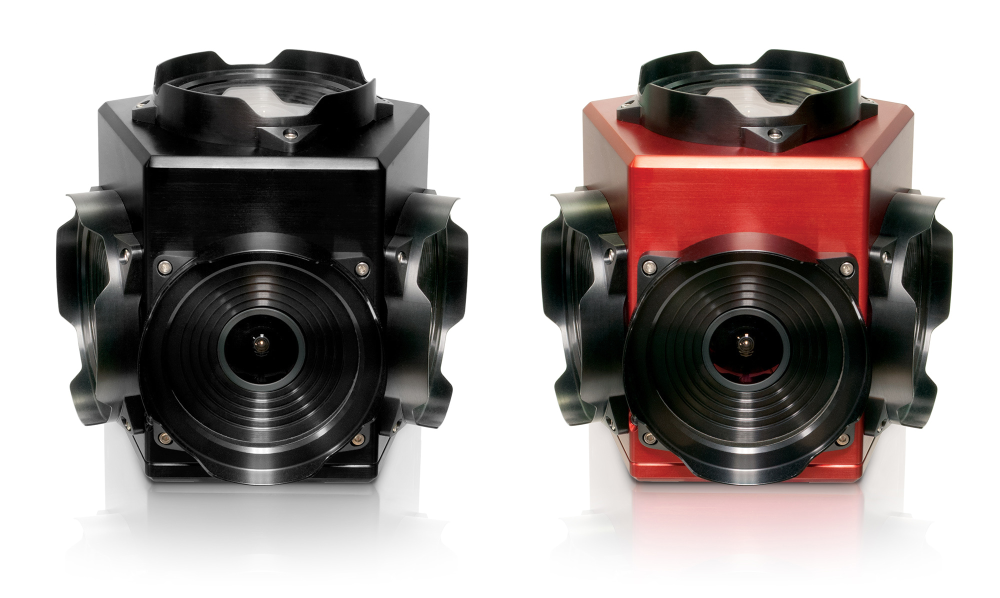

# 360° Video and Audio Capture for VR Applications
[Project: Skrillex Train Dome](#skrillex-train-dome)

[Paul Bourke](#paul-bourke)

[Spherical Image Capture](#spherical-image-capture)

[Fisheye Lenses](#fisheye-lenses)

[Cinemagraphs](#cinemagraphs)

[DIY 360 Rigs](#diy-360-rigs)

[Output Formats](#output-formats)

[Additional Resources and Links](#additional-resources-and-links)

## Skrillex Train Dome

## Paul Bourke

## Spherical Image Capture

## Fisheye Lenses

## Cinemagraphs

http://thecreatorsproject.vice.com/blog/break-from-real-life-with-vr-cinemagraphs

#### Cinemagraphs.com
[cinemagraphs.com](http://cinemagraphs.com/)

## DIY 360 Rigs

http://thecreatorsproject.vice.com/blog/break-from-real-life-with-vr-cinemagraphs

http://punkoryan.com/2011/02/08/shooting-360-degree-video-with-four-gopro-hd-hero-cameras

## Professional 360 Cameras
#### Ladybug5 

https://www.ptgrey.com/ladybug5-360-degree-usb3-spherical-camera-systems

## Output Formats

## Additional Resources and Links
- panorama software
- camera
- rigs
- code

